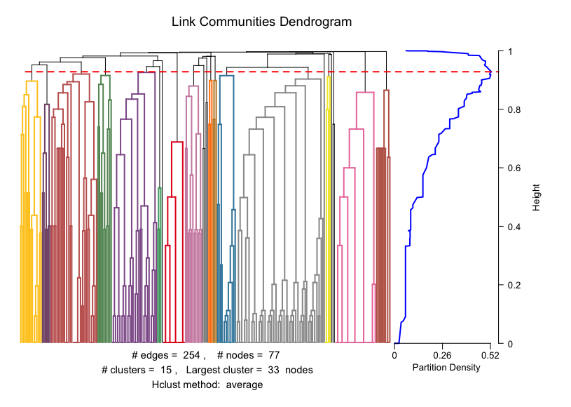
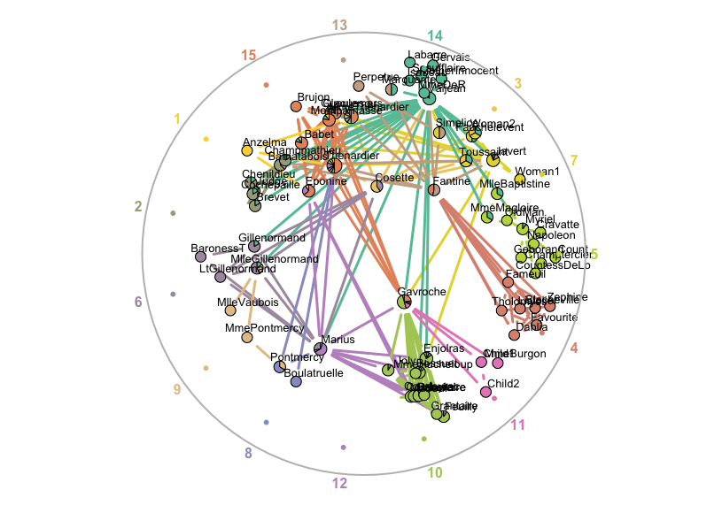

# `linkcomm`

<!-- badges: start -->
[](https://CRAN.R-project.org/package=linkcomm)
[](https://cran.r-project.org/package=linkcomm)
[](https://github.com/alextkalinka/linkcomm/actions)
[](https://www.tidyverse.org/lifecycle/#stable)
<!-- badges: end -->

## Summary
`linkcomm` is an `R` package that provides tools for generating, visualising, and analysing [Link Communities](https://www.nature.com/articles/nature09182) in networks. See the companion [paper](https://academic.oup.com/bioinformatics/article/27/14/2011/194743) for more information.

## Installation

```r
install.packages("linkcomm")
```

## Usage

```r
# Explore the in-built Les Miserables network:
library(linkcomm)
lm <- getLinkCommunities(lesmiserables)
```



```r
# Visualize the communities:
plot(lm, type = "graph", layout = "spencer.circle")
```



```r
# Extract the nodes from the first community:
n1 <- getNodesIn(lm, clusterids = 1)

# Nodes shared by communities 10 and 11:
ns <- get.shared.nodes(lm, comms = 10:11)

# Node community centrality scores:
nc <- getCommunityCentrality(lm)

# Community connectedness scores:
cc <- getCommunityConnectedness(lm)

```

# References

Kalinka AT, Tomancak P (2011). “linkcomm: an R package for the generation, visualization, and analysis of link communities in networks of arbitrary size and type.” *Bioinformatics*, **27**, 2011-2012.
